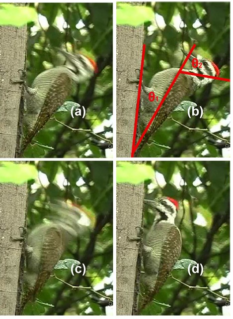

## Abstract

To understand how a woodpecker is able to accelerate its head to such a high velocity in a short amount of time, a multi-rigid-segment model of a woodpecker’s body is established in this study. Based on skeletal specimens and several pecking videos, the parameters of a three-degree-of-freedom model are determined. The high head velocity is found to result from a whipping effect influenced by muscle torque and tendon stiffness. By comparing hinged-rod and rigid-rod responses, three dynamic modes are identified, with Mode II generating the highest free-end velocity. The model is further generalized to a multi-hinge system, showing that free-end velocity increases with the number of hinges. The effects of damping and mass distribution are also discussed.
