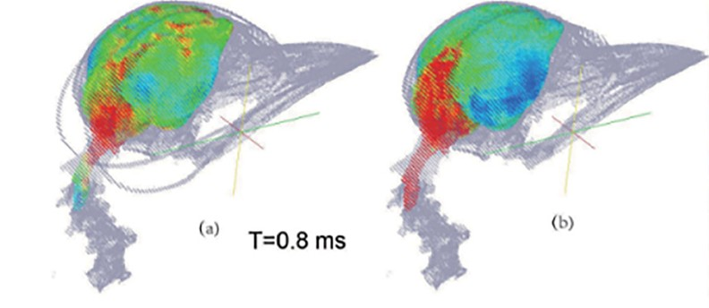

## Abstract

Prevention of brain injury in woodpeckers under high deceleration during the pecking process has long been a biomechanical question. Although several hypotheses have been proposed, the functional role of the hyoid bone has not been fully elucidated. In this work, a material point method (MPM) model of the woodpecker head is developed based on micro-CT images to study the relationship between head impact response and hyoid bone structure. The maximum shear stress in the brainstem (SSS) is used as the injury indicator. The motion of the first cervical vertebra is found to be the main cause of brainstem shear stress. The study shows that the hyoid bone reduces SSS, increases head rigidity, and suppresses post-impact oscillations of internal structures. The mechanical mechanism is discussed and the influence of muscle properties is examined.
