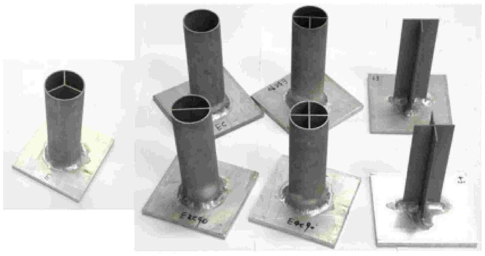

## Abstract

Tubular structures such as circular tubes and square tubes under axial compression are widely used as structural components in engineering applications. Considering differences in tube geometries, boundary conditions and material properties, this review classifies tube failure under axial compression into five mechanisms: progressive buckling, global buckling, inversion, expansion and splitting. Theoretical, experimental and numerical studies on these failure modes are reviewed, and the mechanical responses and energy absorption properties are compared and discussed.
