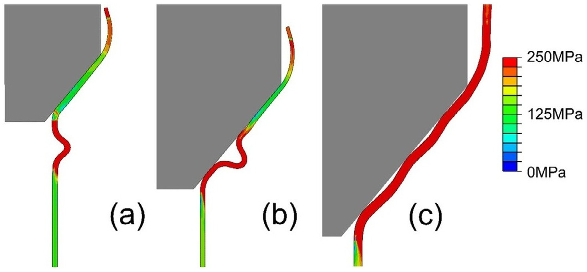

## Abstract

In this study, the theoretical model of the expansion metal tubes reported in [1] is improved by considering the die radius r_die. After introducing the critical die radius r_die determined by the tube radius–thickness ratio and conical die angle, the tube expansion is classified into three deformation modes. Detailed theoretical derivations are provided to extend the applicability of the model. Compared with experiment and FEM results, the model accurately predicts the steady compressional force for tube radius–thickness ratio ≥ 20 and die angle ≤ 40°. The expanded tube radius is also accurately predicted, which is important in metal forming. Finally, the energy absorption capability of expansion tubes is optimized by including material properties and friction effects.
