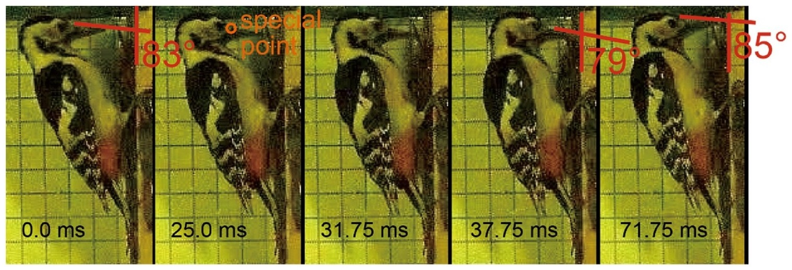

## Abstract

Head impact injuries always cause severe diseases and deaths of human. In contrast, woodpeckers are able to withstand fierce impact during pecking without brain damage. In this study, a trunk-like piezoelectric force sensor was used to measure pecking impulse, and the corresponding pecking process was recorded by a high-speed camera. The woodpecker head was scanned by micro-computed tomography and the pecking process was simulated by the material point method. The simulated impact impulse matches the experimental result, and the energy transmission and brain impact responses are discussed. Head Injury Criterion and Average Resultant Acceleration for woodpeckers are proposed by scaling analyses to measure the possibility of brain damage, and the influence of higher pecking velocities and the rhamphotheca layer in the beak is analyzed.
