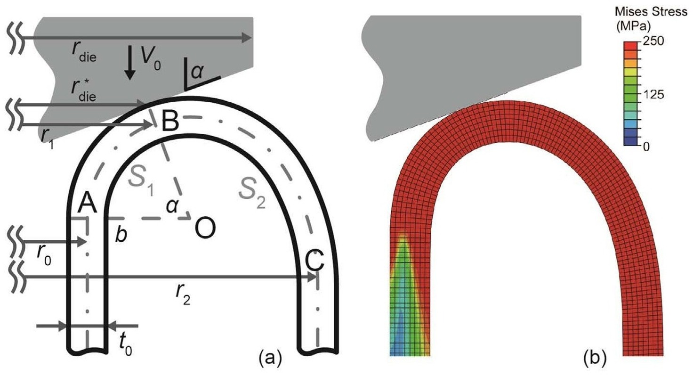

## Abstract

As an important impact energy absorber and a method to produce double-wall tubes, the inversion of metal tubes over a conical die is studied. Inspired by FEM-derived deformation profiles, a theoretical model is proposed in which energy is dissipated through meridional bending and compression, and circumferential expansion. FEM simulations over a wide parameter range validate the model, showing accurate predictions for compressional force and final circular radius. Energy dissipation mechanisms along the tube axis are analyzed, and deformation in the thickness direction is identified as the major source of deviation. Effects of die radius, friction, and dynamic factors are also discussed.
