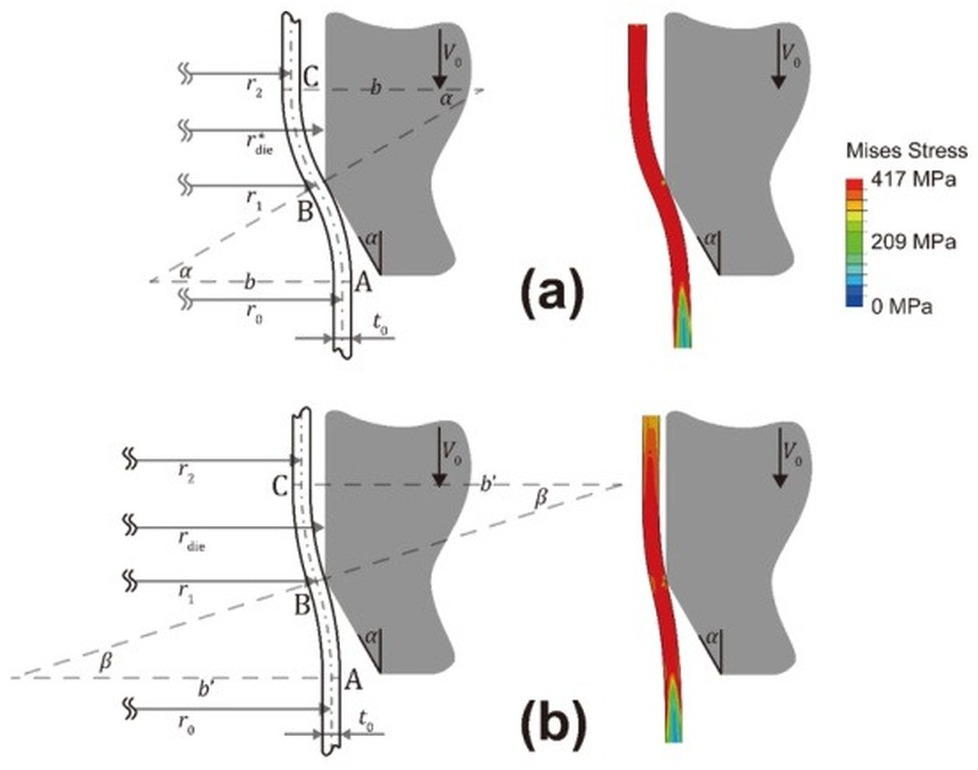

## Abstract

This study proposes the first theoretical model for shrinking metal tubes. According to the relation between the actual die radius and a critical value determined by tube geometry and conical angle, three deformation modes are identified. Experimental data and numerical simulations across a wide parameter range validate the model. Predictions of compressional force, reduced radius, and equivalent plastic strain agree with FEM results for die angles ≤40° and radius–thickness ratio ≥10. Influences of friction, dynamic effects, unsteady deformation stages, and conical angles are analyzed. Comparisons with expansion tubes reveal that shrinking exhibits higher energy absorption at the same deformation ratio, and an optimization is provided to maximize SEA.
