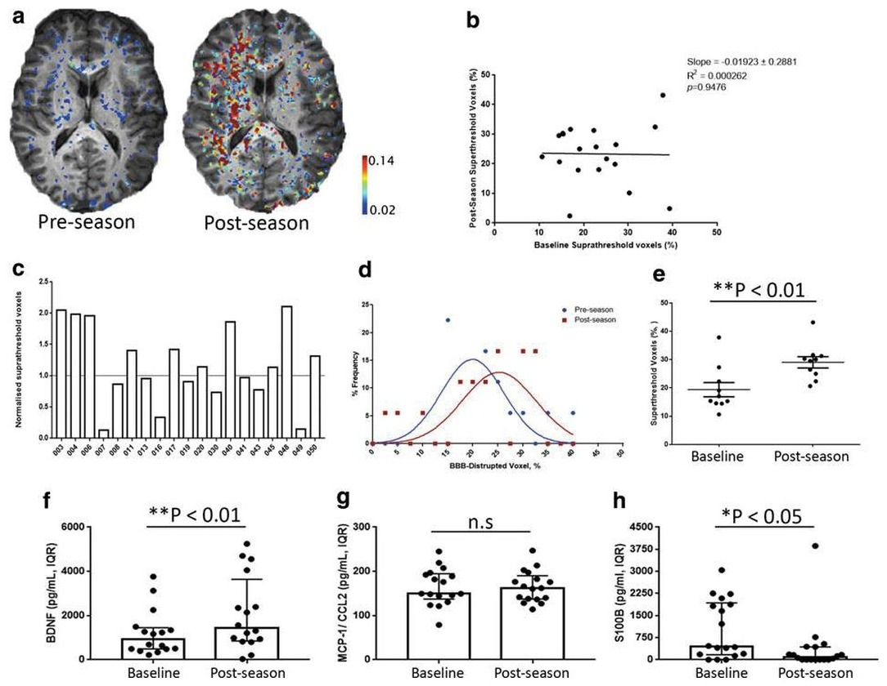

## Abstract

Whereas the diagnosis of moderate and severe traumatic brain injury (TBI) is readily visible on current medical imaging paradigms (magnetic resonance imaging [MRI] and computed tomography [CT] scanning), a far greater challenge is associated with the diagnosis and subsequent management of mild TBI (mTBI), especially concussion which, by definition, is characterized by a normal CT. To investigate whether the integrity of the blood-brain barrier (BBB) is altered in a high- risk population for concussions, we studied professional mixed martial arts (MMA) fighters and adolescent rugby players. Additionally, we performed the linear regression between the BBB disruption defined by increased gadolinium contrast extravasation on dynamic contrast-enhanced magnetic resonance imaging (DCE-MRI) on MRI and multiple biomechanical parameters indicating the severity of impacts recorded using instrumented mouthguards in professional MMA fighters. MMA fighters were examined pre-fight for a baseline and again within 120 h post-competitive fight, whereas rugby players were examined pre-season and again post-season or post-match in a subset of cases. DCE-MRI, serological analysis of BBB biomarkers, and an analysis of instrumented mouthguard data, was performed. Here, we provide pilot data that demonstrate disruption of the BBB in both professional MMA fighters and rugby players, dependent on the level of exposure. Our data suggest that biomechanical forces in professional MMA and adolescent rugby can lead to BBB disruption. These changes on imaging may serve as a biomarker of exposure of the brain to repetitive subconcussive forces and mTBI.
