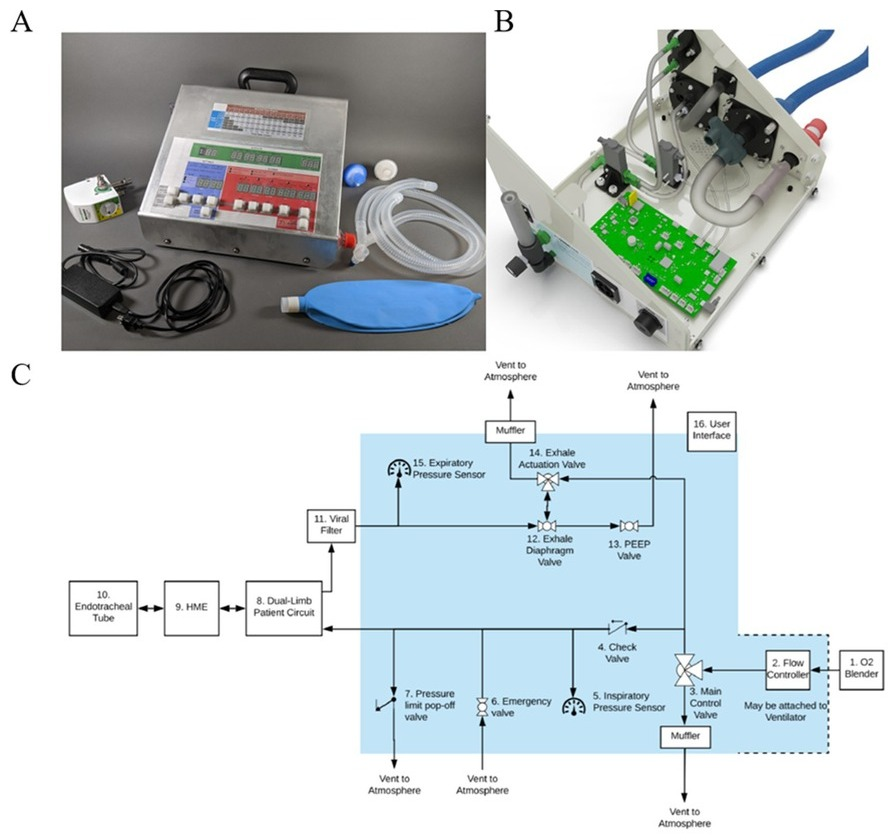

## Abstract

RESEA RCH ARTICL E A low-cost, highly functional, emergency use ventilator for the COVID-19 crisis Samuel J. Raymond ID 1 *, Sam Baker 2 , Yuzhe Liu 1 , Mauricio J. Bustamante 3 , Brett Ley 4 , Michael J. Horzewski 5 , David B. Camarillo 1,5,6,7☯ , David N. Cornfield 8☯ 1 Department of Bioenginee ring, Stanford University , Stanford, CA, United States of America, 2 Department of Comp arative Medicine, Stanford University , Stanford, CA, United States of America, 3 Department of Electrica l Engineeri ng and Computer Science, UC Berkeley, CA, United States of America, 4 Kaiser Pulmon ology and Critical Care, Fontana, CA, United States of America, 5 O2U Inc., Stanfor d, CA, United States of America, 6 Department of Mechanic al Engineering, Stanford University, Stanfor d, CA, United States of America, 7 Department of Neurosur gery, Stanfor d University, Stanford , CA, United States of America, 8 Department of Pediat rics-Pulm onary Medicine, Stanford University , Stanford, CA, United State
