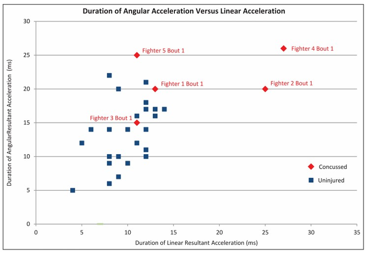

## Abstract

Concern about the consequences of head impacts in US football has motivated researchers to investigate and develop instrumentation to measure the severity of these impacts. However, the severity of head impacts in unhelmeted sports is largely unknown as miniaturised sensor technology has only recently made it possible to measure these impacts in vivo. The objective of this study was to measure the linear and angular head accelerations in impacts in mixed martial arts, and correlate these with concussive injuries. Thirteen mixed martial arts fighters were fitted with the Stanford instrumented mouthguard (MiG2.0) participated in this study. The mouthguard recorded linear acceleration and angular velocity in 6 degrees of freedom. Angular acceleration was calculated by differentiation. All events were video recorded, time stamped and reported impacts confirmed. A total of 451 verified head impacts above 10g were recorded during 19 sparring events (n = 298) and 11 competitive events (n = 153). The average resultant linear acceleration was 38.0624.3g while the average resultant angular acceleration was 256761739 rad/s2. The competitive bouts resulted in five concussions being diagnosed by a medical doctor. The average resultant acceleration (of the impact with the highest angular acceleration) in these bouts was 86.7618.7g and 756163438 rad/s2. The average maximum Head Impact Power was 20.6kW in the case of concussion and 7.15kW for the uninjured athletes. In conclusion, the study recorded novel data for sub-concussive and concussive impacts. Events that resulted in a concussion had an average maximum angular acceleration that was 24.7% higher and an average maximum Head Impact Power that was 189% higher than events where there was no injury. The findings are significant in understanding the human tolerance to short-duration, high linear and angular accelerations.
