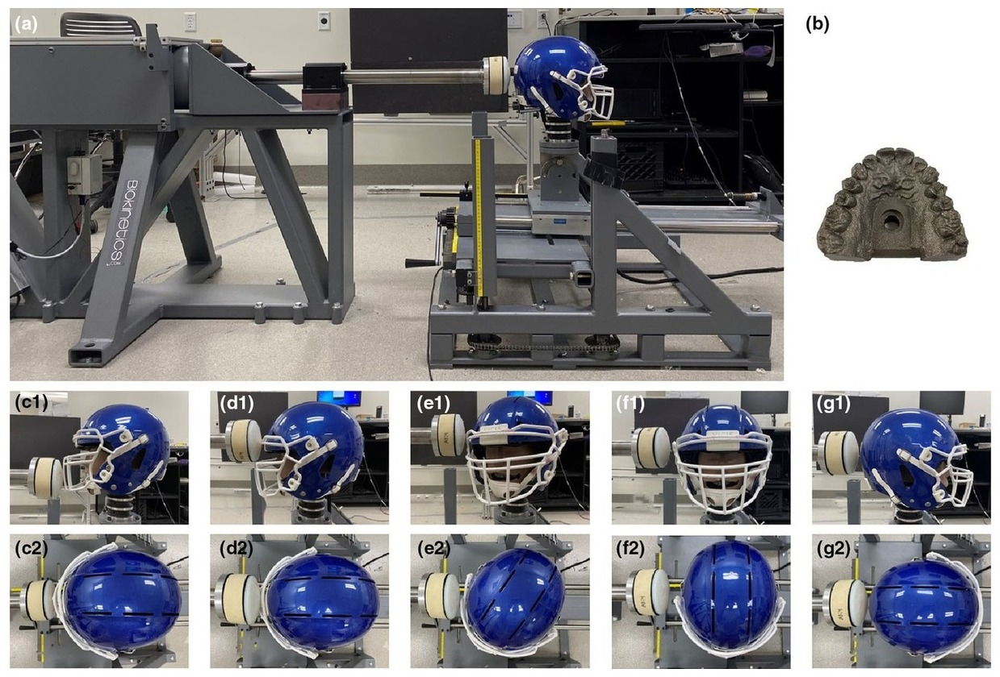

## Abstract

Instrumented mouthguards are widely used to measure head kinematics due to the rigid coupling of upper dentition and skull. This study validates and compares five commonly used instrumented mouthguards using pneumatic impacts delivered to a Hybrid III headform. Results show all devices accurately measure peak angular acceleration, angular velocity, and brain injury criteria values. Mouthguards with sufficiently long sampling windows also provide accurate inputs for a convolutional neural network–based brain model to compute brain strain. Measurement accuracy varies with impact location but is largely insensitive to impact velocity.
