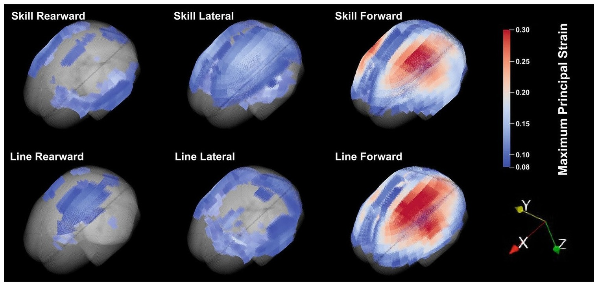

## Abstract

This study investigates head impact kinematics and brain strain in high school American football athletes using an improved instrumented mouthguard (MiG2.0). Across 888 athlete exposures and 602 verified impacts, peak linear acceleration, angular velocity, angular acceleration, and 95th percentile maximum principal strain were quantified. Forward-direction impacts produced significantly higher kinematic magnitudes and brain strain than lateral or rearward impacts, and skill-position athletes experienced greater impact severity than line-position players. No significant differences were found for concussion history, helmet model, or team level. These results offer novel insight into real-world head impact exposure and resulting brain strain in high school athletes.
