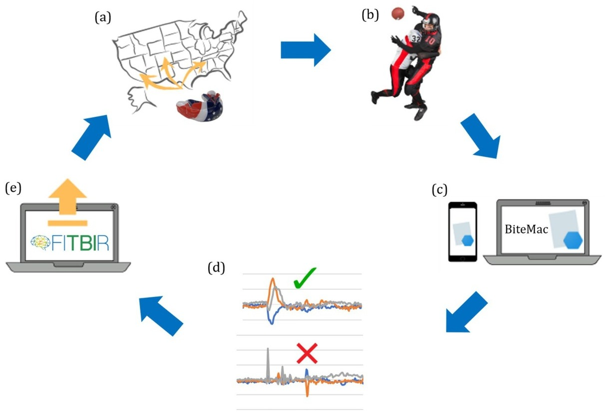

## Abstract

1 Vol.:(0123456789)Scientific Reports | (2021) 11:7501 | https://doi.org/10.1038/s41598-021-87085-2 www.nature.com/scientificreports A new open‑access platform for measuring and sharing mTBI data August G. Domel1,12, Samuel J. Raymond1,12*, Chiara Giordano1,12, Yuzhe Liu1, Seyed Abdolmajid Yousefsani1, Michael Fanton2, Nicholas J. Cecchi1, Olga Vovk3, Ileana Pirozzi1, Ali Kight1, Brett Avery4, Athanasia Boumis4, Tyler Fetters3, Simran Jandu4, William M. Mehring4, Sam Monga5,6, Nicole Mouchawar7, India Rangel4, Eli Rice4, Pritha Roy4, Sohrab Sami4, Heer Singh4, Lyndia Wu1,8, Calvin Kuo2,9, Michael Zeineh7, Gerald Grant10,11 & David B. Camarillo1,2,11 Despite numerous research efforts, the precise mechanisms of concussion have yet to be fully uncovered. Clinical studies on high‑risk populations, such as contact sports athletes, have become more common and give insight on the link between impact severity and brain injury risk through the use of wearable sensors and neurological testing. H
