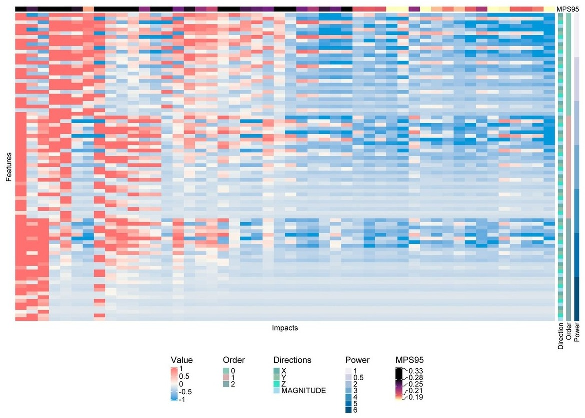

## Abstract

This study investigates the predictive power of various rotational kinematic factors for traumatic brain injury by analyzing their relationships with 95% maximum principal strain (MPS95). Using datasets from laboratory tests, American football, MMA, NHTSA crash tests, and NASCAR events, the study evaluates derivative orders, directions, and polynomial powers of rotational velocity and acceleration. Through regression models and statistical interpretation—including zero-order correlation, structure coefficients, commonality analysis, and dominance analysis—the study identifies angular acceleration, magnitude, and first-power features as the most predictive across most datasets, with notable exceptions in MMA and NASCAR impacts. The results highlight that predictive kinematic factors vary substantially across impact types.
