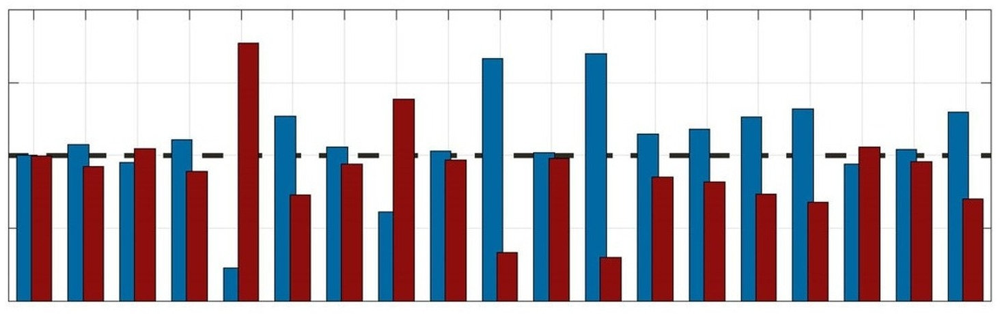

## Abstract

This study evaluates how brain injury criteria (BIC) relate to brain strain across diverse types of head impacts including sports collisions and automotive crash tests. Using linear regression models, the study analyzes 95% maximum principal strain, regional strain metrics, and cumulative strain damage across 18 BIC. Results demonstrate significantly different relationships between BIC and brain strain across datasets, showing that a given BIC value can correspond to different strain levels depending on impact type. These findings highlight the limitations of applying a BIC developed from one impact type to another and emphasize the need for context-specific injury risk estimation.
