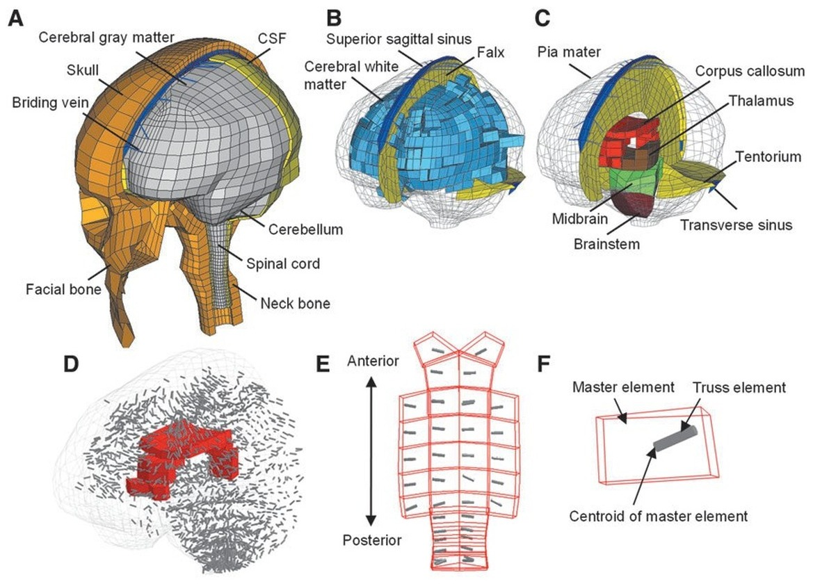

## Abstract

Finite element (FE) models of the human head are valuable instruments to explore the mechanobiological pathway from external loading, localized brain response, and resultant injury risks. The injury predictability of these models depends on the use of effective criteria as injury predictors. The FE-derived normal defor- mation along white matter (WM) fiber tracts (i.e., tract-oriented strain) recently has been suggested as an appropriate predictor for axonal injury. However, the tract-oriented strain only represents a partial depiction of the WM fiber tract deformation. A comprehensive delineation of tract-related deformation may improve the injury predictability of the FE head model by delivering new tract-related criteria as injury predictors. Thus, the present study performed a theoretical strain analysis to comprehensively characterize the WM fiber tract deformation by relating the strain tensor of the WM element to its embedded fiber tract. Three new tract-related strains with exact analytical solutions were proposed, measuring the normal defor- mation perpendicular to the fiber tracts (i.e., tract-perpendicular strain), and shear deformation along and perpendicular to the fiber tracts (i.e., axial-shear strain and lateral-shear strain, respectively). The injury pre- dictability of these three newly proposed strain peaks along with the previously used tract-oriented strain peak and maximum principal strain (MPS) were evaluated by simulating 151 impacts with known outcome (concussion or non-concussion). The results preliminarily showed that four tract-related strain peaks exhibited superior performance than MPS in discriminating concussion and non-concussion cases. This study presents a comprehensive quantification of WM tract-related deformation and advocates the use of orientation-dependent strains as criteria for injury prediction, which may ultimately contribute to an ad- vanced mechanobiological understanding and enhanced computational predictability of brain injury.
