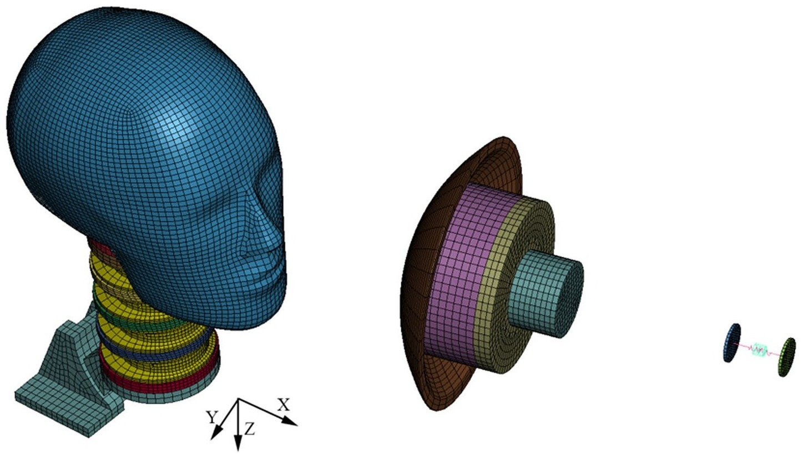

## Abstract

Concussions Physics-Informed Machine Learning Improves Detection of Head Impacts SAMUEL J. R AYMOND ,1 NICHOLAS J. C ECCHI,1 HOSSEIN VAHID ALIZADEH,1 ASHLYN A. C ALLAN,1 ELI RICE,2 YUZHE LIU,1 ZHOU ZHOU,1 MICHAEL ZEINEH,3 and D AVID B. C AMARILLO1,4,5 1Department of Bioengineering, Stanford University, Stanford, CA 94305, USA; 2Stanford Center for Clinical Research, Stanford University, Stanford, CA 94305, USA; 3Department of Radiology, Stanford University, Stanford, CA 94305, USA; 4Department of Neurosurgery, Stanford University, Stanford, CA 94305, USA; and 5Department of Mechanical Engineering, Stanford University, Stanford, CA 94305, USA (Received 31 August 2021; accepted 1 January 2022) Associate Editor Stefan M. Duma oversaw the review of this article. Abstract-In this work we present a new physics-informed machine learning model that can be used to analyze kinematic data from an instrumented mouthguard and detect impacts to the head. Monitoring player impacts is vitally importan
