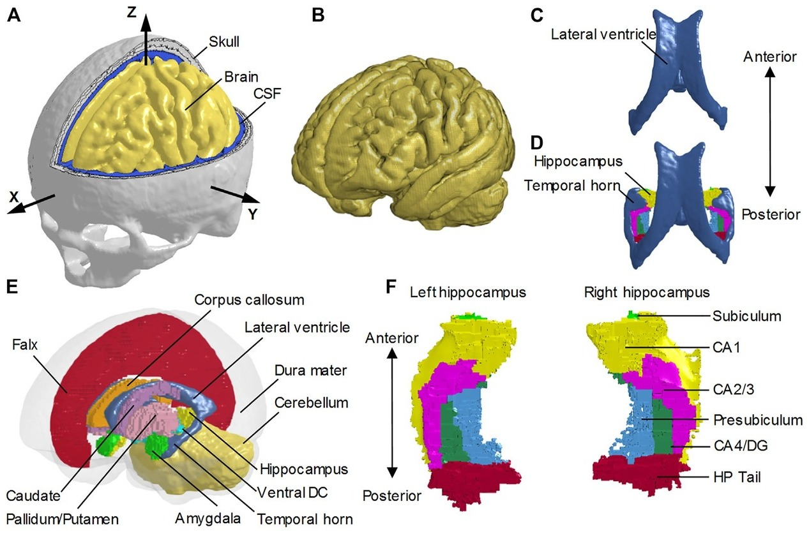

## Abstract

The Presence of the Temporal Horn Exacerbates the Vulnerability of Hippocampus During Head Impacts Zhou Zhou 1,2*†, Xiaogai Li 2†, August G. Domel 1, Emily L. Dennis 3,4, Marios Georgiadis 4, Yuzhe Liu 1, Samuel J. Raymond 1, Gerald Grant 5,6, Svein Kleiven 2‡, David Camarillo 1,5,7‡ and Michael Zeineh 4*‡ 1Department of Bioengineering, Stanford University, Stanford, CA, United States, 2Neuronic Engineering, KTH Royal Institute of Technology, Stockholm, Sweden, 3TBI and Concussion Center, Department of Neurology, University of Utah, Salt Lake City, UT, United States, 4Department of Radiology, Stanford University, Stanford, CA, United States, 5Department of Neurosurgery, Stanford University, Stanford, CA, United States, 6Department of Neurology, Stanford University, Stanford, CA, United States, 7Department of Mechanical Engineering, Stanford University, Stanford, CA, United States Hippocampal injury is common in traumatic brain injury (TBI) patients, but the underlying pathogenesis rema
