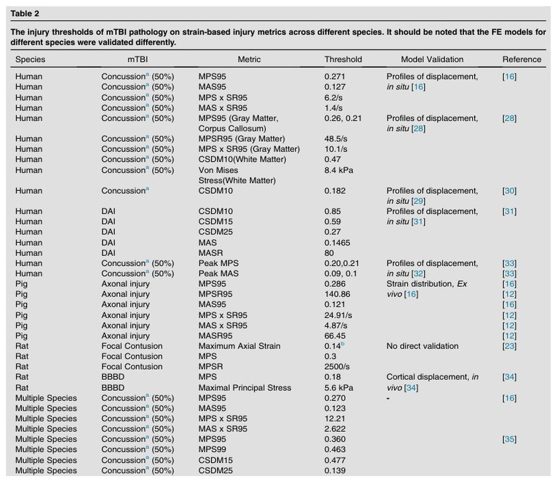

## Abstract

T raumatic brain injury (TBI) is a global health concern. Mild TBI (mTBI) which accounts for the majority of TBI cases, is hard to detect since often the imaging is normal but can still cause brain damage and long-term sequelae. Physiologically, acute primary damage to the brain is thought to be caused by tissue deformation from the inertial movement of the brain after rapid head rotation. Respecting tissue biomechanics, animal models are often used to understand the pathophysiology of mTBI. We have reviewed the literature focusing on connecting biome- chanics with mTBI pathologies at the tissue scale using neuroimaging, neurobehavioral tests, and pathologies across species, particularly studies using strain and strain rate. These studies have found strain and strain rate predict mTBI pathol- ogy and strain is generalizable across species, including small animals, large animals, and humans. We propose that re- searchers can leverage tissue-level strain and strain rate to bridge biomechanics and mTBI pathology . Addresses 1 Department of Bioengineering, Stanford University, Stanford, CA, USA 2 Wallace H. Coulter Department of Biomedical Engineering, Georgia Institute of T echnology and Emory University, Atlanta, GA, USA 3 Department of Radiology, Stanford University, Stanford, CA, USA 4 Department of Neurosurgery , Duke University, Durham, NC, USA
