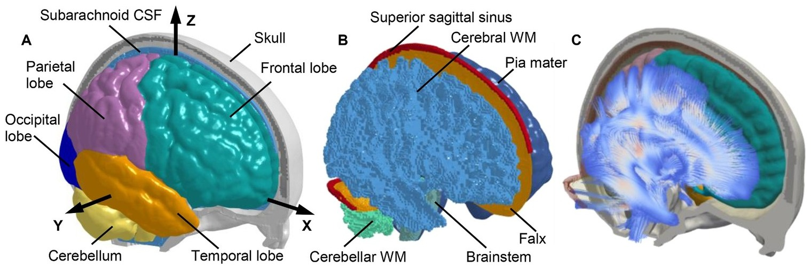

## Abstract

Traumatic brain injury (TBI) is an alarming global public health issue with high morbidity and mortality rates. Although the causal link between external insults and consequent brain injury remains largely elusive, both strain and strain rate are generally recognized as crucial factors for TBI onsets. With respect to the flourishment of strain-based investigation, ambiguity and inconsistency are noted in the scheme for strain rate calculation within the TBI research community. Furthermore, there is no experimental data that can be used to validate the strain rate responses of finite element (FE) models of the human brain. The current work presented a theoretical clarification of two commonly used strain rate computational schemes: the strain rate was either calculated as the time derivative of strain or derived from the rate of deformation tensor. To further substantiate the theoretical disparity, these two schemes were respectively implemented to estimate the strain rate responses from a previous-published cadaveric experiment and an FE head model secondary to a concussive impact. The results clearly showed scheme-dependent responses, both in the experimentally determined principal strain rate and model-derived principal and tract-oriented strain rates. The results highlight that cross-scheme comparison of strain rate responses is inappropriate, and the utilized strain rate computational scheme needs to be reported in future studies. The newly calculated experimental strain rate curves in the supplementary material can be used for strain rate validation of FE head models. Statement of significance: - Delineates a theoretical clarification of two algorithms for strain rate computation. - Highlights the strain rate responses directly depends on the computational schemes. - Presents experimental strain rate curves, serving as references for strain rate validation of finite element head models. 1.
