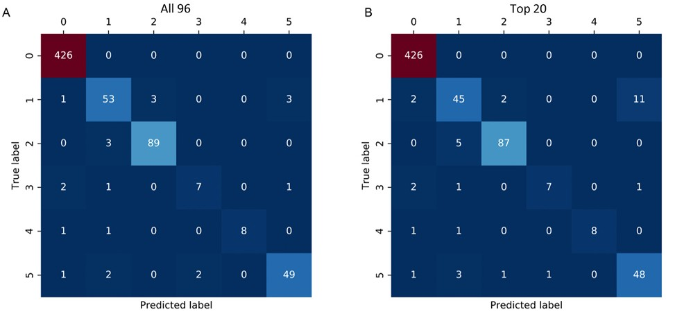

## Abstract

This study investigates the spectral characteristics of head kinematics across different types of head impacts using a machine-learning-based classification framework. A random forest classifier utilizing spectral densities of linear acceleration and angular velocity was trained on 3262 impacts from lab reconstruction, American football, mixed martial arts, and car crash data. The classifier achieved a median accuracy of 96% across 1000 random train-test partitions. Spectral characteristics varied systematically across impact types, with mixed martial arts impacts showing higher high-frequency spectral densities relative to low-frequency regions. Type-specific nearest-neighbor regression models demonstrated improved performance over baseline models, suggesting that subtype-based modeling enhances strain prediction. These findings enable better understanding of impact-type-specific kinematic signatures and offer tools for evaluating impact-simulation systems and augmenting on-field datasets.
