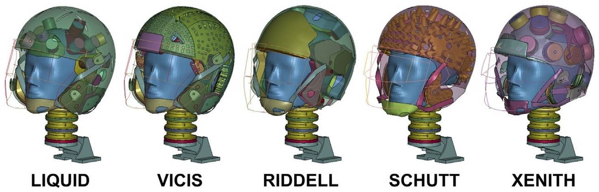

## Abstract

This study develops and evaluates a finite element (FE) model of an American football helmet incorporating 21 liquid shock absorbers distributed throughout the shell. Using an anthropomorphic test headform and impactor FE setup, the helmet was tested under a protocol representative of National Football League concussive impacts at multiple locations and velocities, as well as lower-velocity subconcussive impacts. Head kinematics were used to compute the Head Acceleration Response Metric (HARM) and brain strain from an FE head model. The liquid helmet achieved the lowest HARM values in most conditions and yielded substantial reductions in both HARM and brain strain compared to four existing helmet designs, demonstrating the promise of liquid shock absorbers for improved helmet safety performance.
