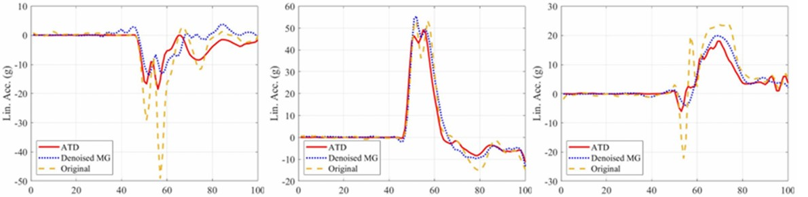

## Abstract

Wearable devices used for measuring head impact kinematics are inherently noisy due to imperfect coupling with the human body. This study developed one-dimensional convolutional neural network (1D-CNN) models to denoise tri-axial linear acceleration and angular velocity signals recorded from instrumented mouthguards. Using 163 dummy head impacts for training, validation was performed at three levels: kinematics, brain injury criteria, and tissue-level strain and strain rate. Denoising reduced pointwise RMSE by 36% and peak absolute error by 56%, while six brain injury criteria errors decreased by 82% on average. Maximum principal strain and strain-rate errors were reduced by 35% and 69%, respectively. Blind testing on 118 college football impacts and 413 PMHS impacts demonstrated similar improvements. The 1D-CNN approach provides an effective method for reducing measurement noise in mouthguard-derived head kinematics and supports future real-world TBI monitoring.
