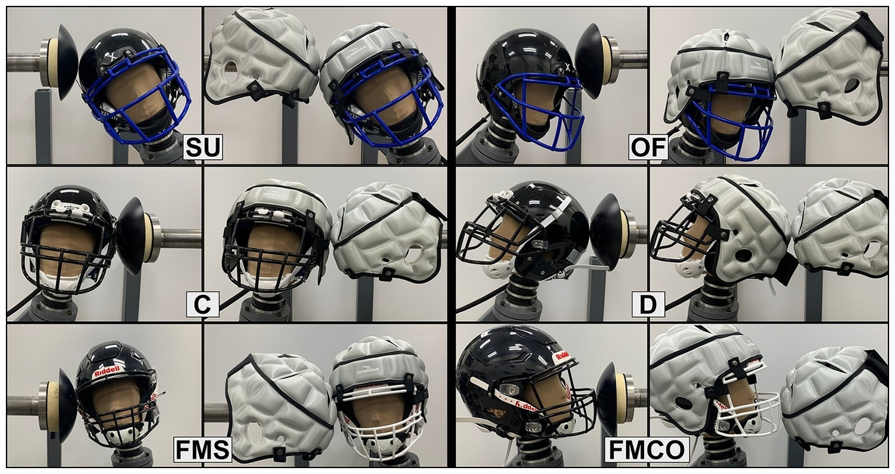

## Abstract

S.I. : Concussions II Padded Helmet Shell Covers in American Football: A Comprehensive Laboratory Evaluation with Preliminary On-Field Findings NICHOLAS J. C ECCHI ,1 ASHLYN A. C ALLAN,1 LANDON P. W ATSON,1 YUZHE LIU,1 XIANGHAO ZHAN,1 RAMANAND V. V EGESNA,2 COLLIN PANG,1 ENORA LE FLAO,1 GERALD A. G RANT,3,4,5 MICHAEL M. Z EINEH,6 and D AVID B. C AMARILLO1,3,7 1Department of Bioengineering, Stanford University, Stanford, CA 94305, USA; 2Department of Biomedical Engineering, University of Southern California, Los Angeles, CA 90089, USA; 3Department of Neurosurgery, Stanford University, Stanford, CA 94305, USA; 4Department of Neurology, Stanford University, Stanford, CA 94305, USA; 5Department of Neurosurgery, Duke University, Durham, NC 27710, USA; 6Department of Radiology, Stanford University, Stanford, CA 94305, USA; and 7Department of Mechanical Engineering, Stanford University, Stanford, CA 94305, USA (Received 29 November 2022; accepted 8 February 2023) Associate Editor Stefan M. Du
