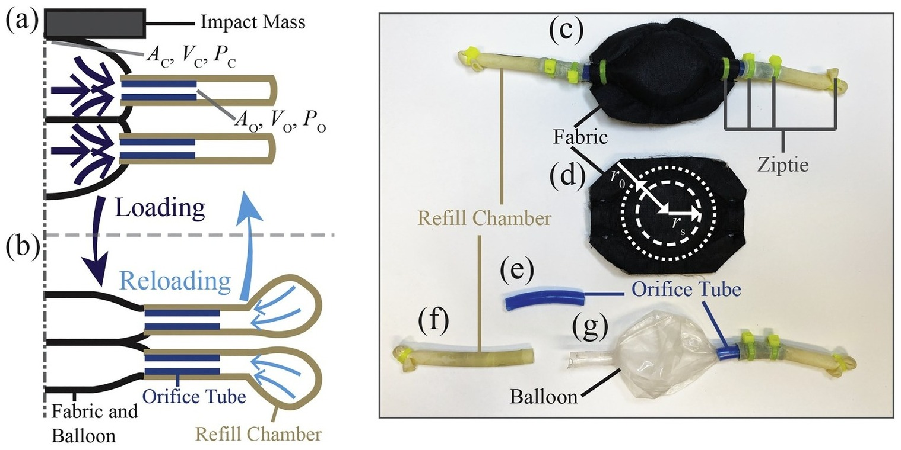

## Abstract

Advances in shock absorber technology are often translated to wearable personal protective equipment to protect humans from impact-related injuries. In this study, the authors leveraged the energy dissipation of fluid flow using soft structures to prototype a novel wearable hydraulic shock absorber, the Soft Hydraulic Shock. The device achieved an efficient energy absorption ratio of 100% across a range of impact loading conditions and maintained stable energy dissipation across a wide temperature range. Finite element analyses further explored its behavior under different design parameters and impact loadings. When implemented into a full helmet system, the Soft Hydraulic Shock significantly mitigated brain injury risk, demonstrating the promise of wearable hydraulic shock absorbers for protective equipment.
