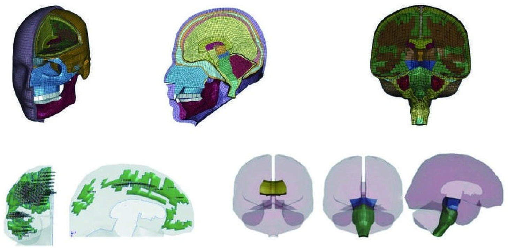

## Abstract

创伤性脑损伤（traumatic brain injury,TBI）是发病率、患病率最高的神经系统疾病，为全社会带来了巨大的公共卫生负担。深入研究TBI的生物力学原理有助于提升头部防护效果，发展快速评估技术并采取及时干预，从而降低伤情恶化的风险。人类头部有限元模型（finite element head model,FEHM）作为一种数值分析工具，能够模拟头部在受到冲击时的动态响应，包括脑组织的应力应变时空分布、颅内压的变化等，为理解创伤性脑损伤的力学机制提供了重要依据。本文详细总结了国内外主流的人类头部有限元模型的现状与发展，追溯了模型的发展历程，总结了模型的特点并介绍了基于有限元模型的TBI机制研究进展。对相关研究的总结和梳理将有助于开发新型FEHM，并为创伤性脑损伤的风险评估及防护装备的设计提供理论指导和技术支撑。
