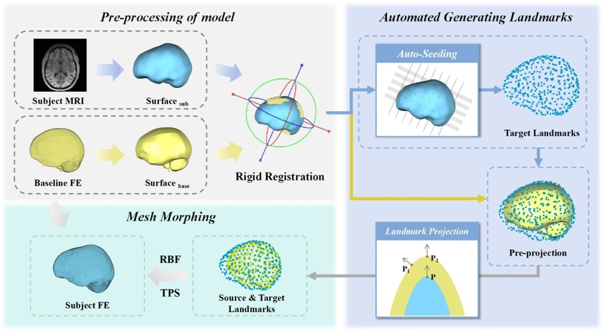

## Abstract

Finite element head models (FEHMs) have been widely used to study the biomechanics in traumatic brain injury (TBI). Most FEHMs are constructed to reflect the average head shape, which inevitably leads to the omission of individual brain morphology. In this study, an automated mesh morphing method based on radial basis function-thin plate spline (RBF-TPS) with automated landmark extraction and projection was developed. Five representative subject-specific head models and the baseline model were subjected to head kinematics from six datasets covering diverse impact scenarios. Results showed that morphology-related deviations increased with loading severity, reaching up to 0.21 for MPS95 and 0.14 s^-1 for MPSR95. Logistic regression indicated that TBI risk thresholds varied by approximately 19.4% for MPS95 and 11.4% for MPSR95 across representative models. These findings indicate that subject-specific morphology affects strain response beyond size scaling alone, underscoring the importance of incorporating individual morphology into brain injury prediction models.
